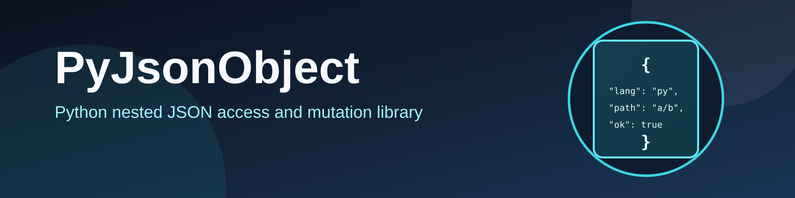

# PyJsonObject

`PyJsonObject` is a Python library for reading and updating nested JSON values via slash-separated key paths.

## Features

- Read nested values with paths like `user/profile/name`
- Read/write array values with bracket syntax, e.g. `items/[0]/id`
- Special array tokens:
  - `[^]` = first element
  - `[$]` = last element
- Safe reads with `default=...`
- Optional `force=True` writes that create/reshape intermediate structures
- File helpers: `from_file(...)`, `to_file(...)`

## Installation

### Install from source (editable)

```bash
python3 -m pip install -e .
```

### Build distribution artifacts

```bash
python3 -m pip install build
python3 -m build
```

## Requirements

- Python `>=3.8`
- Runtime dependencies:
  - `kingkybel-pyflashlogger>=2.5.0`
  - `kingkybel-pyfundamentals>=0.4.6`

## Path syntax

- Path separator: `/`
- Object key segment: `config/theme`
- Array index segment: `users/[0]/name`
- Supported array selectors: `[0]`, `[1]`, ... `[^]`, `[$]`

## Quick usage

### Basic get/set

```python
from pyjsonobject import JsonObject

obj = JsonObject(json_str='{"user": {"name": "Ada", "age": 36}}')
obj.set("user/name", "Ada Lovelace", force=False)
print(obj.get("user/name"))
```

### Read with default

```python
from pyjsonobject import JsonObject

obj = JsonObject(json_obj={"user": {"name": "Ada"}})
city = obj.get("user/city", default="unknown")
print(city)  # unknown
```

### Force-create nested path

```python
from pyjsonobject import JsonObject

obj = JsonObject(json_str="{}")
obj.set("a/[0]/name", "node-0", force=True)
print(obj.get("a/[0]/name"))
```

### Array prepend/append tokens

```python
from pyjsonobject import JsonObject

arr = JsonObject(json_str="[]")
arr.set("[$]", "last", force=True)   # append
arr.set("[^]", "first", force=True)  # prepend

print(arr.get("[^]"))  # first
print(arr.get("[$]"))  # last
```

### Work with files

```python
from pyjsonobject import JsonObject

obj = JsonObject(filename="input.json")
obj.set("meta/version", 2, force=True)
obj.to_file("output.json", indent=2)
```

## API overview

- `JsonObject(json_str=None, filename=None, json_obj=None)`
- `get(keys, default=None)`
- `set(keys, value, force=False, dryrun=False)`
- `update(keys, mapping, force=False, deep=False, dryrun=False)`
- `delete(keys, silent=False, dryrun=False)`
- `key_exists(keys)`
- `get_many(paths, default=None)`
- `from_string(json_str)` / `from_object(obj)` / `from_file(filename)`
- `to_str(indent=2)` / `to_file(filename, indent=4, dryrun=False)`
- `get_json()` / `to_dict()` / `copy()`
- `JsonObject.assert_json_files_valid(paths)`

## Behavior notes

### `force=False` (default)

- The path must already exist and container types must match.
- Leaf updates only succeed when the existing value type matches the new value type.
- Type mismatches raise `JsonValueMismatch`.

### `force=True`

- Missing path segments are created as needed.
- Existing incompatible intermediate containers may be reshaped to satisfy the target path.
- `[^]` and `[$]` can be used to prepend/append when writing to arrays.

### `update(...)` merge behavior

- `update(..., deep=False)` performs a shallow dict update at the target path.
- `update(..., deep=True)` recursively merges nested dictionaries.
- `force=True` allows creation/replacement of the target path with a dict before merge.

## Public typing aliases

The implementation provides explicit aliases in `pyjsonobject.types`:

- `JSONScalar = bool | int | float | str`
- `JSONValue = JSONScalar | list | dict`
- `JSONObjectContainer = list | dict`

## Development

Run tests:

```bash
python3 -m pytest -q
```
